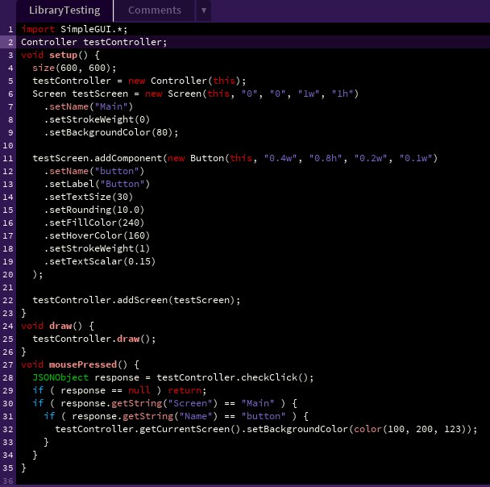
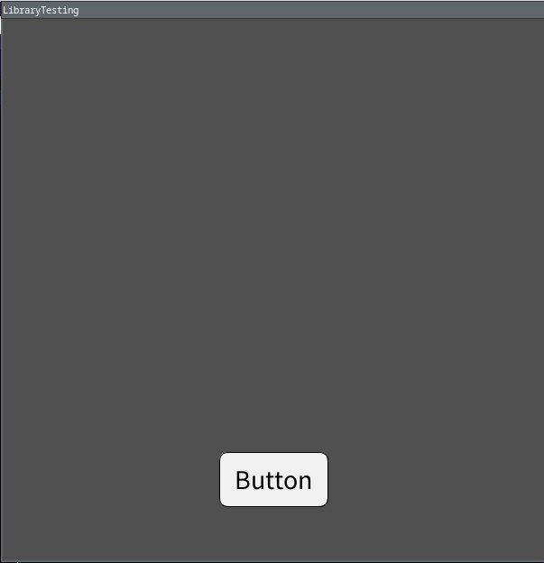

<p align="center">
  <a href="https://noahzydel.com">
    
    <h1 align="center">Noah Zydel</h1>
  </a>
</p>

---

- [📖 Overview](#-overview)
- [📝 Examples](#-examples)
- [⭐️ Current Version](#-current-version)
- [🔜 Hopeful Features](#-hopeful-features)
- [🪚 Built With](#-built-with)
- [🔨 Build Instructions](#-build-instructions)

# SimpleGUI
A GUI library created for the Processing programming environment. It is aimed at aiding in rapid prototyping, it is still relatively feature-bare.

## 📖 Overview
A Processing library that adds a few GUI component classes to let you quickly design screen(s).

**Controller**

This is the main object, and will hold all of the screens you create. It is charge of displaying screens and their components, handling click/key events, and changing through your various screens. It is generated with ```new Controller(this)```.

**Screen**

These are the containers for all of the components. Multiple can be created, and added to the controller.

**General Components**

Components can be initialized with a size/position, or with a json that defines it's settings. Sizes can either be an absolute pixel value (ex: ```123a```), or a percentage of the screen's width/height (ex: ```0.5w, 1h```). Components have their own code to draw themselves, determine if they've been clicked, determine if they're being moused over, and can be given a ```Payload```, which is a JSONObject that is used for running custom functions from a component.

## 📝 Examples
**Simple Setup with Button**

The following code is all that is needed to setup the controller, add a screen that takes up the entire window, and add a simple button. It also includes code that checks if the button was clicked, and changes the background color if it is.





## ⭐️ Current Version
v0.0.1
- Current components available:
  - Button
  - DropDown
  - Image
  - Slider
  - Text
  - TextBox
- Controller is able to print a hierarchy of all of the screens/their components
  
## Previous Versions
N/A

## 🔜 Hopeful Features
- Update the sizing functionality so that it only performs the conversion on setting/parent updates. Currently, every time an object is being drawn it is recalculating its dimensions/position
- Allow components to be positioned based on other components instead of just parent/absolute
  - Basically just steal a lot of css/html functionality
- Allow Screens/Components to be exported/imported as files
  
## 🪚 Built With
- Java
- Processing

## 🔨 Build Instructions